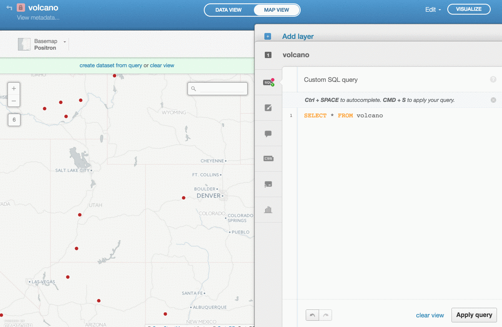
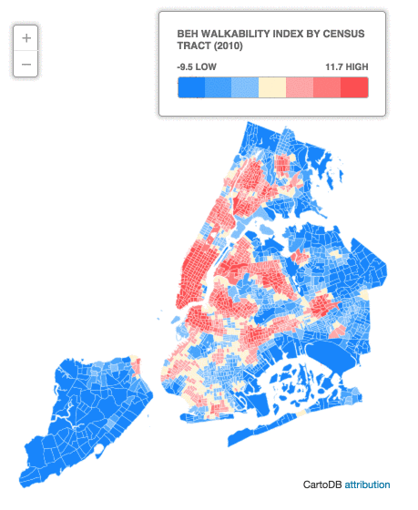

#BEH-GIS Data Portal

####Features:
* Choose Geography
* Choose Variable to map
* Export as Table
* Export as Shapefile 
* Link to Data Dictionary (in Markdown, rendered as html)

##CartoDB
Why use CartoDB?

####Possible to leverage CartoDB json files w/ D3.
* [CartoDB with D3](http://blog.cartodb.com/cartodb-makes-d3-maps-a-breeze/) 
		

####Leverage PostGIS - geoprocessing with SQL
* Buffer example:

####Leverage PostGIS - SQL API - export as:
* CSV
* SHP
* SVG
* KML
* SpatiaLite
* GeoJSON.
	
		https://{account}.cartodb.com/api/v2/sql?q=SELECT * FROM {table_name} LIMIT 1

####With or Without a basemap.

####Interface To Do:
* Build better looking Jekyll bootstrap site (aesthetic)
* Fancy Jekyll Landing Pages
	* [landing page theme](http://shaneweng.com/landing-page-theme/)

	* [grayscale theme](http://jeromelachaud.github.io/grayscale-theme/)

	* [A whole bunch of other themes we could use](http://jekyllthemes.org/)

##Why use Jekyll?

* No database! 
* Just:
	* html
	* javascript
	* css/sass
	* markdown 	
* supported by GitHub

####Interface To Do:
* Use Javascript variables so can stay on the main index.html page

####Interface To Do:
Link dropdown to vizID

		var vizID = 'https://dms2203.cartodb.com/api/v2/viz/a7e9cb92-9b52-11e4-b578-0e9d821ea90d/viz.json'

####Misc. 

[MapSense continous zooming w/ D3](http://beh-gis.github.io/pages/mapsense/)

* [MapSense Examples](https://developer.mapsense.co/examples/)

#[Check out the site](http://beh-gis.github.io/data/mhhi.html)